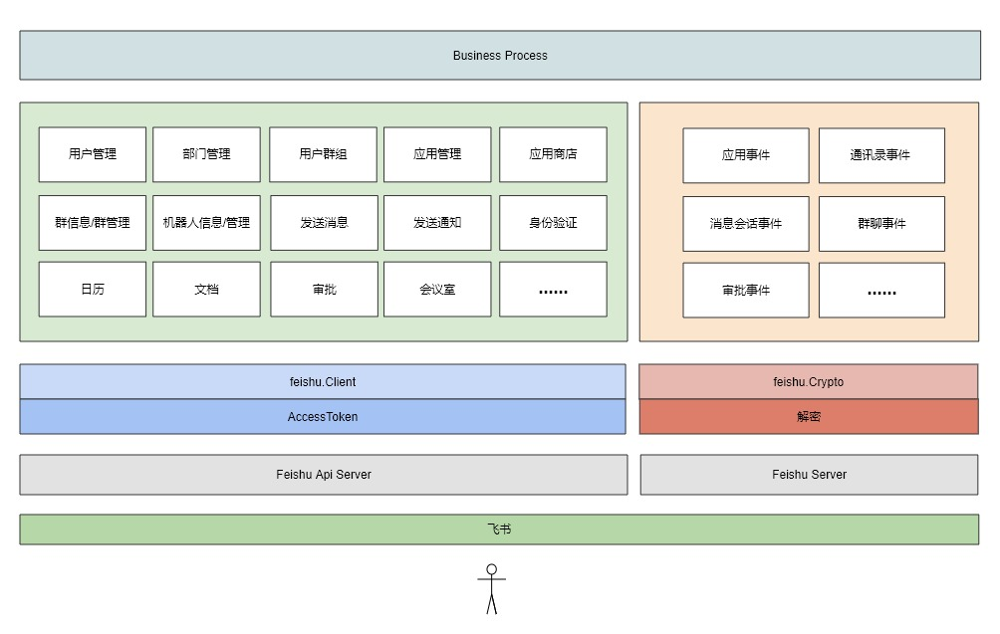

# fastwego/feishu

A fast [feishu](https://open.feishu.cn/) development sdk written in Golang

[](https://pkg.go.dev/github.com/fastwego/feishu?tab=doc)
[](https://goreportcard.com/report/github.com/fastwego/feishu)

## 快速开始 & demo

```shell script
go get github.com/fastwego/feishu
```
```go
// 内部应用 tenant_access_token 管理器
Atm = &feishu.DefaultAccessTokenManager{
    Id:    FeishuConfig["AppId"],
    Cache: file.New(os.TempDir()),
    GetRefreshRequestFunc: func() *http.Request {
        payload := `{
            "app_id":"` + FeishuConfig["AppId"] + `",
            "app_secret":"` + FeishuConfig["AppSecret"] + `"
        }`
        req, _ := http.NewRequest(http.MethodPost, feishu.ServerUrl+"/open-apis/auth/v3/tenant_access_token/internal/", strings.NewReader(payload))
        return req
    },
}

// 创建 飞书 客户端
FeishuClient = feishu.NewClient()

// 调用 api 接口
tenantAccessToken, _ := Atm.GetAccessToken()

params := url.Values{}
params.Add("page_size", "10")
request, _ := http.NewRequest(http.MethodGet, feishu.ServerUrl+"/open-apis/meeting_room/building/list?"+params.Encode(), nil)
resp, err := FeishuClient.Do(request, tenantAccessToken)
```

完整演示项目：

[https://github.com/fastwego/feishu-demo](https://github.com/fastwego/feishu-demo)

## 架构设计



## 框架特点

- 使用 Go 语言，开发快、编译快、部署快、运行快，轻松服务海量用户
- 丰富的[文档](https://pkg.go.dev/github.com/fastwego/feishu) 和 [演示代码](https://github.com/fastwego/feishu-demo) ，快速上手，5 分钟即可搭建一个完整地飞书 App
- 独立清晰的模块划分，快速熟悉整个框架，没有意外，一切都是你期望的样子
- 直接调用接口，最少封装，自由嵌入业务逻辑
- 简单而强大的 AccessToken 管理：
    - 默认将 AccessToken 缓存到本机临时目录下
    - 过期自动重新获取
    - 支持自定义 AccessToken 的获取和管理方法，扩展应用场景
    - 支持企业内部应用/应用商店应用不同类型的 AccessToken 管理
- 事件回调加解密处理
- 丰富完整&支持自定义的日志
- 支持自定义 http.Client：
    - 默认使用 http.DefaultClient

## 活跃的开发者社区

FastWeGo 是一套丰富的 Go 服务开发框架，支持飞书、微信等服务，拥有庞大的开发者用户群体

你遇到的所有问题几乎都可以在社区找到解决方案

欢迎提交 pull request / issue / 文档，一起让飞书开发更快更好！

Faster we go together!

[加入开发者交流群](https://github.com/fastwego/fastwego.dev#%E5%BC%80%E5%8F%91%E8%80%85%E4%BA%A4%E6%B5%81%E7%BE%A4)
